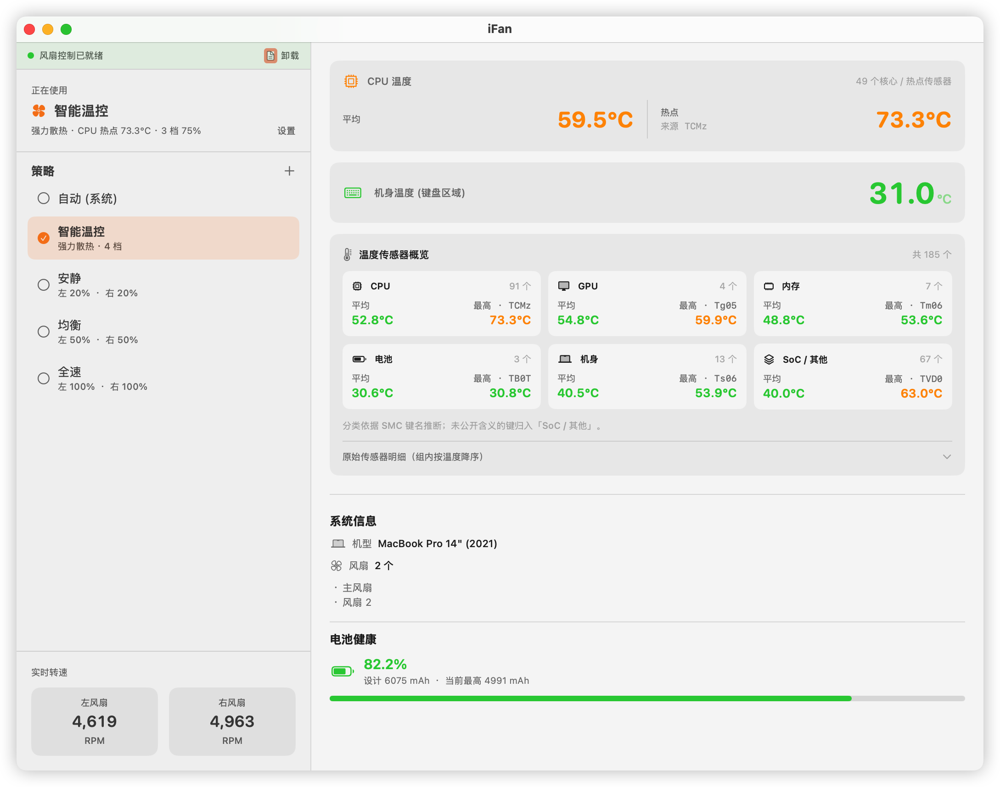
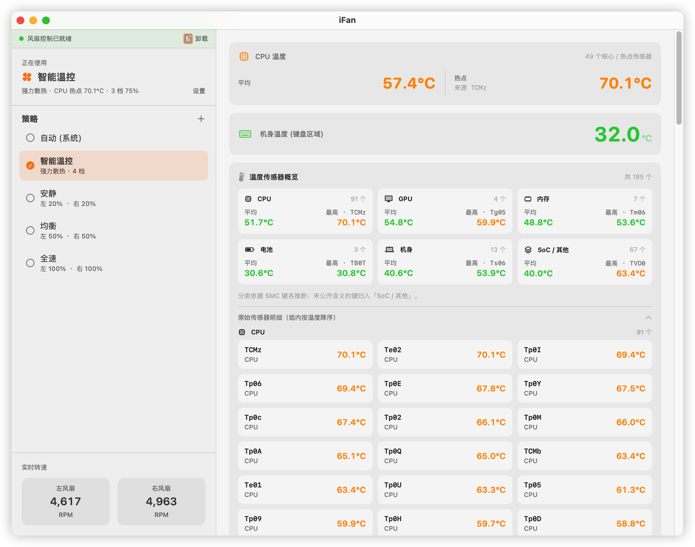
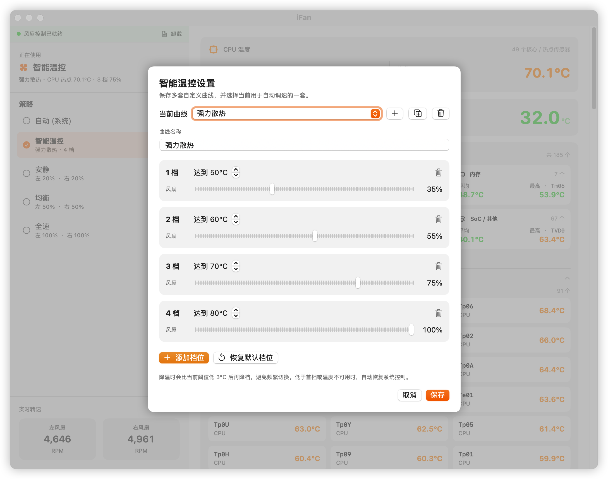
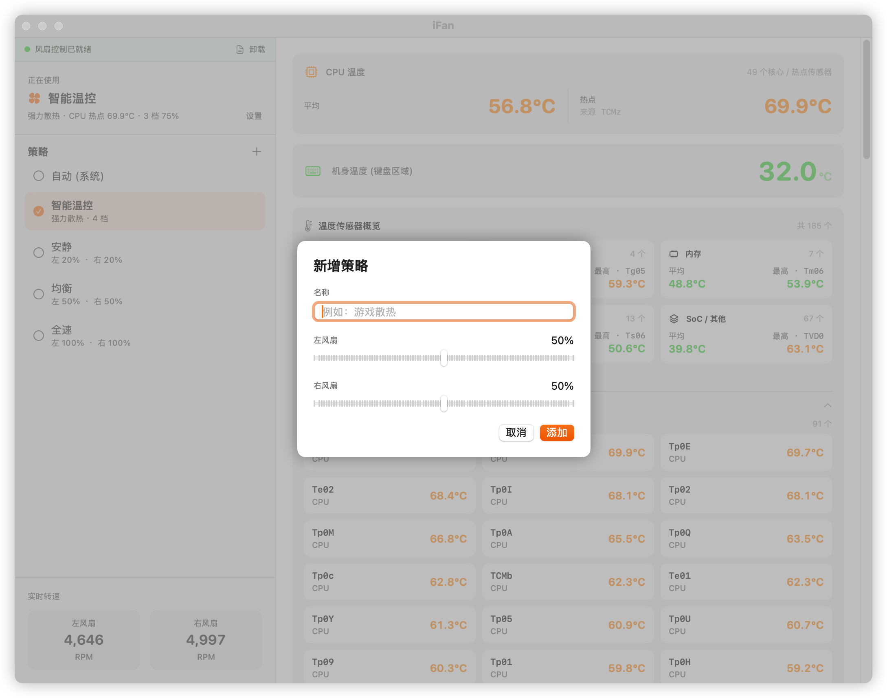
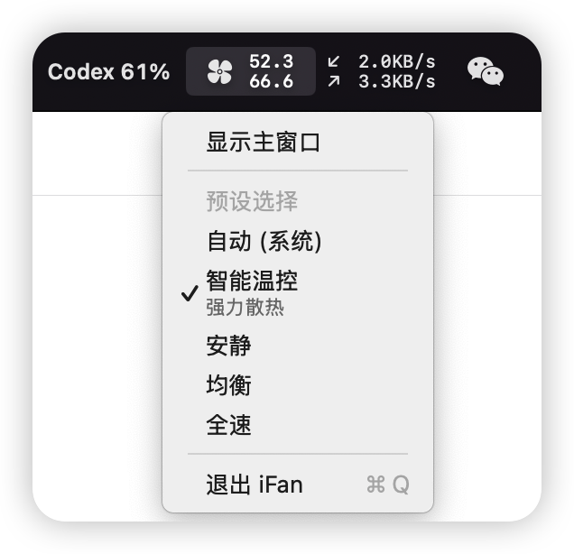
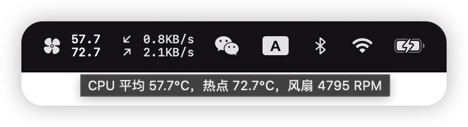

# iFan

macOS 菜单栏温度监控与风扇控制工具，面向 Apple Silicon Mac。不同机型暴露的 SMC 传感器和风扇键并不完全相同，实际可用项目会随硬件变化。

## 功能

- **CPU 平均与热点温度**：优先读取 `Tp*` / `TC*` / `Te*` / `Tf*` 核心及热点传感器；机型未暴露这些键时回退到 `TPD*` / `TRD*` 聚合键，并标出当前热点来源
- **温度聚合与明细**：按 CPU、GPU、内存、电池、机身、SoC / 其他汇总传感器数量、平均温度与最高温度；可展开已经识别到的全部有效温度 SMC 键
- **分批刷新**：CPU、GPU、机身和风扇每 2 秒更新；其余温度传感器每轮读取 4 或 8 个并循环更新，避免一次读取上百个 SMC 键造成负载尖峰
- **风扇转速**：显示风扇 0 / 1 的实际 RPM；不存在的风扇显示为 `--`
- **风扇策略**：默认提供「自动（系统）」「智能温控」「安静」「均衡」「全速」五个策略；其中前两个固定保留，其余策略和用户新增策略可排序或删除
- **自定义手动策略**：分别设置两个风扇在硬件最小/最大 RPM 区间内的百分比；`0%` 表示硬件最低转速，并非停转
- **自定义温控曲线**：根据 CPU 热点温度自动切换风扇档位；可创建、复制、重命名、删除和切换多套曲线，每套曲线支持 1–10 个档位，并以 3°C 回差避免频繁升降档
- **固定宽度菜单栏**：使用 AppKit `NSStatusItem` 锁定占位，显示静态风扇图标、CPU 平均温度和热点温度；CPU 温度不可用时回退显示 GPU 温度，数值变化不会挤动其他状态栏图标
- **低开销监控与控制**：持久缓存 SMC 键列表、类型与数据长度，重启后无需重复探测；手动策略仅在目标变化时写入，并每 30 秒低频校验一次
- **后台菜单栏运行**：关闭主窗口后隐藏 Dock 图标并继续监控；菜单栏可重新打开窗口、切换策略或退出应用
- **守护进程日志**：安装风扇控制后可在主窗口查看、刷新和复制守护进程日志
- **原生尺寸图标**：重新制作完整 macOS App Icon 图标集，适配 Dock 的视觉尺寸
- **温度安全着色**：温度 < 55°C 绿色、55°C（含）至 75°C（不含）橙色、≥ 75°C 红色
- **机型识别**：已知机型显示设备名称和年份；未收录机型显示系统型号标识符
- **电池健康度**：笔记本上显示电池设计容量 / 当前最大容量 / 健康百分比

## 系统要求

- macOS 14.0 (Sonoma) 及以上
- Apple Silicon Mac；温度键、风扇数量和可写控制键取决于具体机型
- 温度读取无需 root 权限
- **风扇控制**需要安装 root 守护进程（应用内安装或卸载时会请求管理员授权）
- 当前控制实现面向具有两个 SMC 风扇通道的机型；无风扇或不同风扇布局的机型仅建议使用温度监控

## 安装

### 方式一：源码编译

```bash
git clone https://github.com/Zorabi/iFans.git
cd iFans
# 默认仅进行 Release 编译，不会安装或启动
bash build.sh

# 可选：直接运行构建产物
bash build.sh --run

# 可选：显式指定安装目录，并在安装后启动
bash build.sh --install /Applications --run
```

### 方式二：Xcode 打开

```bash
open iFan.xcodeproj
```

按 ⌘R 运行（Debug 模式）。

## 使用说明

1. 首次启动即可查看温度、风扇转速、机型和电池信息；这些监控功能不需要安装守护进程
2. 如需控制风扇，点击左上角「安装风扇控制」并完成管理员授权
3. 安装完成后可切换默认策略，或通过 `+` 新建左右风扇独立调速的手动策略
4. 选择「智能温控」后，点击当前策略旁的「设置」可管理多套曲线及其温度档位；低于首档阈值或 CPU 温度不可用时会交还系统控制
5. 默认和自定义手动策略中的百分比会映射到各风扇的硬件最小/最大 RPM，`0%` 不等于停止风扇
6. 点击关闭按钮或按 `⌘W`：主窗口隐藏且 Dock 图标消失，应用继续在菜单栏运行
7. 完全退出：按 `⌘Q`，或点击菜单栏状态项 →「退出 iFan」

## 风扇控制原理

安装后，应用通过命令文件和心跳文件与 root 守护进程通信。守护进程根据机型实际存在的 SMC 键执行以下操作：

- 启动时先将 `F0Md` / `F1Md`（或小写变体）恢复为系统模式；如果存在 `Ftst`，同时将其清零
- 手动控制时按需设置 `Ftst=1`，再写入 `F0Md=1` / `F1Md=1` 和 `F0Tg` / `F1Tg` 目标 RPM
- 目标 RPM 始终限制在对应风扇的硬件最小值与最大值之间
- 守护进程每 2 秒检查命令和心跳；目标变化时立即写入，目标未变化时每 30 秒重新确认一次
- 守护进程具备 **8 秒心跳看门狗**：应用不再发送心跳时自动清除手动模式并恢复系统控制
- 守护进程由 `launchd` 常驻管理，直到在应用内点击「卸载」；卸载或收到终止信号时也会先恢复系统控制
- 智能温控低于首档阈值或无法读取 CPU 温度时会主动恢复系统自动模式；降温时需低于当前阈值 3°C 才会降档
- 旧版保存的单条温控曲线会自动迁移为「我的温控」；新用户默认提供「安静温控」「均衡温控」「强力散热」三套可编辑曲线

> ⚠️ 风扇控制涉及底层固件写入，请合理设置转速。iFan 会将目标转速限定在风扇硬件支持的最小/最大范围内，避免极端值。

## 项目结构

```
iFan/
├── iFanApp.swift          # 入口 + 菜单栏 + Dock 管理
├── AppState.swift         # 数据状态管理
├── Models.swift           # 策略/传感器数据模型
├── SMC.swift              # AppleSMC IOKit 底层读写
├── SensorReader.swift     # 温度/转速/电池传感器读取
├── FanController.swift    # 风扇控制守护进程 + IPC
├── MainWindowView.swift   # 主窗口 SwiftUI 视图
└── Assets.xcassets/       # App 图标
```

## 功能截图

> 截图来自 Apple Silicon Mac 实机运行；温度、转速、传感器数量和电池数据会因机型与负载实时变化。

### 主窗口与实时监控



主窗口一次覆盖风扇控制守护进程状态、当前策略、五个默认策略、两个风扇通道的实时转速、CPU 平均/热点温度与热点 SMC 键、机身温度、温度传感器分类聚合、机型/风扇信息和电池健康度。温度会按安全区间显示为绿、橙、红三色。

### 原始温度传感器明细



展开「原始传感器明细」后，可查看 CPU、GPU、内存、电池、机身及 SoC / 其他的全部有效 SMC 温度键；各组按温度降序排列，便于定位热点来源。

### 智能温控曲线



智能温控支持切换、新建、复制、重命名和删除多套曲线；每套曲线可增删最多 10 个档位，并分别配置温度阈值与风扇转速。界面同时提供默认档位恢复和 3°C 回差说明。

### 自定义手动策略



自定义策略可以命名，并分别设置两个风扇在硬件转速区间内的百分比；创建后可从主窗口或菜单栏快速切换，也可拖动排序和删除。

### 菜单栏状态与快捷策略



点击菜单栏中的 iFan 状态项，可以快速显示主窗口、查看并切换风扇策略。选中「智能温控」时，策略名称下方会显示当前使用的温控曲线，方便直接确认正在生效的配置。



状态项使用固定宽度显示 CPU 平均温度与热点温度，数值变化时不会挤动相邻图标；将指针停留在状态项上，还可查看两项温度及当前风扇转速的完整摘要。

## FAQ

**Q: 支持 Intel Mac 吗？**
A: 当前不支持。传感器筛选、机型识别、风扇控制和安全恢复逻辑均按 Apple Silicon Mac 设计，尚未完成 Intel 机型适配与验证。

**Q: 风扇切换策略后没有反应？**
A: 先确认左上角显示绿色圆点和「风扇控制已就绪」，再打开旁边的日志检查目标 RPM、SMC 写入结果及实际转速。无风扇、单风扇或 SMC 键布局不同的机型可能只能使用监控功能。

**Q: 如何卸载？**
A: 先在主窗口左上角点击「卸载」，停止守护进程并移除 `/Library/LaunchDaemons/com.ifan.helper.plist`；再退出应用并删除 `iFan.app`。当前卸载操作不会自动清理 `/Library/Application Support/iFan` 中的日志/命令文件或用户偏好。

**Q: 适配哪些机型？**
A: 温度监控会动态枚举当前 Mac 暴露的 SMC 温度键，因此各机型显示的类别和数量可能不同。当前风扇控制固定使用 `F0*` / `F1*` 两个通道，只应在具有对应双风扇 SMC 键的机型上使用；MacBook Air 等无风扇机型没有可控制的风扇。

**Q: 为什么完整传感器列表不是每秒更新？**
A: Apple Silicon 设备可能暴露上百个温度 SMC 键。iFan 首次识别机型后会持久缓存 SMC 键列表、类型与数据长度；重启时仍重新读取实时温度，不会把温度值本身持久化。日常运行时每 2 秒更新 CPU、GPU、机身和风扇等关键数据，其余温度传感器每轮读取 4 或 8 个并循环更新，从而摊平 IOKit 调用和 CPU 唤醒。传感器类别根据 SMC 键名前缀推断，Apple 未公开含义的键会归入「SoC / 其他」。

## 致谢

本项目基于 [chansss/iFans](https://github.com/chansss/iFans) 的源码继续改进。感谢原作者 [chansss](https://github.com/chansss) 创建并开源 iFans，为 Apple Silicon 风扇控制、SMC 读取和守护进程实现提供了扎实基础。

本次改进重点包括 Apple Silicon 核心/热点传感器补全、全部温度传感器聚合、固定宽度菜单栏、监控性能优化以及 macOS App Icon 适配。

## 参与贡献

欢迎提交 Issue 和 Pull Request。开始之前请阅读 [贡献指南](CONTRIBUTING.md)，尤其注意 SMC 兼容性、风扇安全恢复和性能回归验证要求。

## License

本 Fork 作为整体依据 [GNU Affero General Public License v3.0](LICENSE) 发布。任何通过网络向用户提供本软件功能的修改版本，也必须向这些用户提供对应源代码。

源自 [chansss/iFans](https://github.com/chansss/iFans) 的上游代码仍保留原作者的 MIT 版权与许可声明，详见 [LICENSE-MIT](LICENSE-MIT)。
